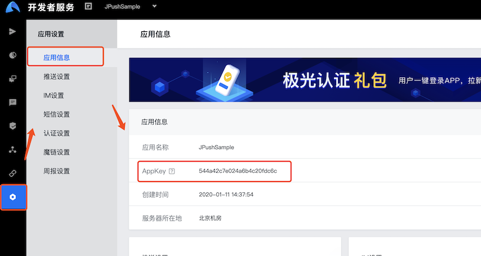

# JPushSample

极光推送Android客户端使用指南，极光推送官网: https://www.jiguang.cn/push

## 关于我

[](https://github.com/xuexiangjys)   [](http://blog.csdn.net/xuexiangjys)   [](https://www.jianshu.com/u/6bf605575337)   [](https://juejin.im/user/598feef55188257d592e56ed)   [](https://www.zhihu.com/people/xuexiangjys)

---

## 前言

极光推送是国内最早做第三方消息推送平台的公司，在消息推送界还是相对有影响力的。我最早是在2016年接触到极光消息推送的，那时候公司需要做消息推送业务，但是由于之前没做过消息推送，且自建消息推送平台代价太高，而且稳不稳定谁也不敢打包票，于是就选择了当时较为有名的极光推送。

那么当时我为什么选择极光推送呢？

* 1.免费。免费版本的每个 Appkey 的最高推送频率为 600 次/分钟，而且没有推送数量限制，者对于消息推送业务刚起步的企业来说，完全够用了。

* 2.上手简单，文档齐全。平台官网上的文档非常详细，下载下来的演示demo也非常丰富，通过简单的几行代码就可以轻松接入。

* 3.功能丰富。比起小米推送、华为推送、信鸽推送、友盟推送来说，极光推送的功能是最全的。想具体了解这几种推送的可参见我的开源框架[XPush](https://github.com/xuexiangjys/XPush).

* 4.社区支持度高。就拿我们Android来说，不仅支持原生集成，还支持React Native、Flutter、Weex、HBuilder、Cordova等混合开发方式。

那么极光推送真的有那么好吗？其实也不全是，我在使用的过程中也发现了一些问题：

* 1.推送的到达率差一点。只要应用退到后台被系统回收或者被用户杀死，基本就很难再收到推送了。这点自然比不上那些手机厂商的推送。

* 2.没有免费开放厂商通道推送集成。想要集成厂商通道推送的话，还需要充钱成为VIP才行。

不过如果你是消息推送的初学者的话，我想极光推送肯定是你不二的选择。那么下面来跟着我学习如何使用极光推送吧！

---

## 快速集成指南

> 本文是基于`jpush:3.5.4`和`jcore:2.2.6`版本介绍的，暂只介绍最新推荐的使用方法，那些过时的用法这里我就不多介绍了，想了解的可以去[极光推送官方文档](https://docs.jiguang.cn/jpush/client/Android/android_sdk/)查看。

### 集成前的准备工作

> 在接入极光推送前，首先需要获取到应用的AppKey，它是应用的唯一标识。

1.创建极光推送开发者帐号

要创建极光推送开发者帐号，请访问极光推送官方网站: https://www.jiguang.cn/push


2.创建应用

进入极光控制台后，点击“创建应用”按钮，填写应用名称即可创建应用成功。同时点击“推送设置”，在 Android 版块填上你的应用包名，选择保存即可。


3.获取应用的AppKey

在极光控制台点击"应用设置"中的"应用信息"，获取应用的AppKey。



### 引入依赖库

#### 方法一 jcenter自动集成

> 使用 jcenter 自动集成的开发者，不需要在项目中添加 jar 和 so，jcenter 会自动完成依赖；在 AndroidManifest.xml 中不需要添加任何 JPush SDK 相关的配置，jcenter 会自动导入。

1.配置项目的`build.gradle`文件

```
android {

    defaultConfig {
        applicationId "com.xxx.xxx" //JPush平台上注册的应用包名.

        ...

        ndk {
            //选择要添加的对应 cpu 类型的 .so 库。
            abiFilters 'armeabi', 'armeabi-v7a', 'arm64-v8a'
            //,'x86', 'x86_64', 'mips', 'mips64'
        }
        manifestPlaceholders = [
                JPUSH_PKGNAME: defaultConfig.applicationId,
                JPUSH_APPKEY : "你的 Appkey ",//值来自开发者平台取得的AppKey
                JPUSH_CHANNEL: "default_developer",
        ]
    }

}

dependencies {
    ...
    //引入JPush依赖库
    implementation 'cn.jiguang.sdk:jpush:3.5.4'
    implementation 'cn.jiguang.sdk:jcore:2.2.6'
}
```

2.配置项目的`AndroidManifest.xml`文件

```
<manifest xmlns:android="http://schemas.android.com/apk/res/android"
    package="com.xuexiang.jpush">

    <application>

        <!-- 1.这个是自定义Service，要继承极光JCommonService，可以在更多手机平台上使得推送通道保持的更稳定 -->
        <service
            android:name=".PushService"
            android:enabled="true"
            android:exported="false"
            android:process=":pushcore">
            <intent-filter>
                <action android:name="cn.jiguang.user.service.action" />
            </intent-filter>
        </service>

        <!-- 2.用户自定义接收消息器,所有你想要知道的消息都在这里-->
        <receiver android:name=".core.push.PushMessageReceiver">
            <intent-filter>
                <action android:name="cn.jpush.android.intent.RECEIVE_MESSAGE" />
                <category android:name="${applicationId}" />
            </intent-filter>
        </receiver>

    </application>

</manifest>
```

[点击参见自动集成的项目源码](https://github.com/xuexiangjys/JPushSample/tree/master/jpush-remote)


#### 方法二 本地手动集成

1.首先你需要先去下载SDK，下载地址: https://docs.jiguang.cn/jpush/resources/

2.解压SDK，将压缩包下的libs内容复制到项目的libs下

3.配置项目的`build.gradle`文件

```
android {

    defaultConfig {
        applicationId "com.xxx.xxx" //JPush平台上注册的应用包名.

        ...

        ndk {
            //选择要添加的对应 cpu 类型的 .so 库。
            abiFilters 'armeabi', 'armeabi-v7a', 'arm64-v8a'
            //,'x86', 'x86_64', 'mips', 'mips64'
        }
        manifestPlaceholders = [
                JPUSH_PKGNAME: defaultConfig.applicationId,
                JPUSH_APPKEY : "你的 Appkey ",//值来自开发者平台取得的AppKey
                JPUSH_CHANNEL: "default_developer",
        ]
    }

    sourceSets {
        //设置libs目录为so包的加载目录
        main {
            jniLibs.srcDirs = ['libs']
        }
    }

}
```

4.配置项目的`AndroidManifest.xml`文件

```
<manifest xmlns:android="http://schemas.android.com/apk/res/android"
    xmlns:tools="http://schemas.android.com/tools"
    package="com.xxx.xxx">

    <permission
        android:name="${applicationId}.permission.JPUSH_MESSAGE"
        android:protectionLevel="signature" />

    <!-- Required  一些系统要求的权限，如访问网络等-->
    <uses-permission android:name="${applicationId}.permission.JPUSH_MESSAGE" />
    <uses-permission android:name="android.permission.RECEIVE_USER_PRESENT" />
    <uses-permission android:name="android.permission.INTERNET" />
    <uses-permission android:name="android.permission.WAKE_LOCK" />
    <uses-permission android:name="android.permission.READ_PHONE_STATE" />
    <uses-permission android:name="android.permission.WRITE_EXTERNAL_STORAGE" />
    <uses-permission android:name="android.permission.READ_EXTERNAL_STORAGE" />
    <uses-permission android:name="android.permission.WRITE_SETTINGS" />
    <uses-permission android:name="android.permission.VIBRATE" />
    <uses-permission android:name="android.permission.MOUNT_UNMOUNT_FILESYSTEMS" />
    <uses-permission android:name="android.permission.ACCESS_NETWORK_STATE" />
    <uses-permission android:name="android.permission.ACCESS_WIFI_STATE" />

    <!-- 用于开启 debug 版本的应用在6.0 系统上 层叠窗口权限 -->
    <uses-permission android:name="android.permission.SYSTEM_ALERT_WINDOW" />
    <!-- Optional for location -->
    <uses-permission android:name="android.permission.ACCESS_COARSE_LOCATION" />
    <uses-permission android:name="android.permission.CHANGE_WIFI_STATE" />
    <uses-permission android:name="android.permission.ACCESS_FINE_LOCATION" />
    <uses-permission android:name="android.permission.ACCESS_LOCATION_EXTRA_COMMANDS" />
    <uses-permission android:name="android.permission.CHANGE_NETWORK_STATE" />
    <uses-permission android:name="android.permission.GET_TASKS" />

    <application>
        <!-- Required SDK核心功能-->
        <activity
            android:name="cn.jpush.android.ui.PushActivity"
            android:configChanges="orientation|keyboardHidden"
            android:exported="false"
            android:theme="@android:style/Theme.NoTitleBar">
            <intent-filter>
                <action android:name="cn.jpush.android.ui.PushActivity" />

                <category android:name="android.intent.category.DEFAULT" />
                <category android:name="${applicationId}" />
            </intent-filter>
        </activity>
        <!-- Required SDK 核心功能-->
        <!-- 可配置android:process参数将PushService放在其他进程中 -->
        <service
            android:name="cn.jpush.android.service.PushService"
            android:exported="false"
            android:process=":pushcore">
            <intent-filter>
                <action android:name="cn.jpush.android.intent.REGISTER" />
                <action android:name="cn.jpush.android.intent.REPORT" />
                <action android:name="cn.jpush.android.intent.PushService" />
                <action android:name="cn.jpush.android.intent.PUSH_TIME" />
            </intent-filter>
        </service>
        <!-- since 3.0.9 Required SDK 核心功能-->
        <provider
            android:name="cn.jpush.android.service.DataProvider"
            android:authorities="${applicationId}.DataProvider"
            android:exported="false" />
        <!-- since 1.8.0 option 可选项。用于同一设备中不同应用的JPush服务相互拉起的功能。 -->
        <!-- 若不启用该功能可删除该组件，将不拉起其他应用也不能被其他应用拉起 -->
        <service
            android:name="cn.jpush.android.service.DaemonService"
            android:enabled="true"
            android:exported="true">
            <intent-filter>
                <action android:name="cn.jpush.android.intent.DaemonService" />
                <category android:name="${applicationId}" />
            </intent-filter>
        </service>
        <!-- since 3.1.0 Required SDK 核心功能-->
        <provider
            android:name="cn.jpush.android.service.DownloadProvider"
            android:authorities="${applicationId}.DownloadProvider"
            android:exported="true" />
        <!-- Required SDK核心功能-->
        <receiver
            android:name="cn.jpush.android.service.PushReceiver"
            android:enabled="true"
            android:exported="false">
            <intent-filter android:priority="1000">
                <!--Required  显示通知栏 -->
                <action android:name="cn.jpush.android.intent.NOTIFICATION_RECEIVED_PROXY" />
                <category android:name="${applicationId}" />
            </intent-filter>
            <intent-filter>
                <action android:name="android.intent.action.USER_PRESENT" />
                <action android:name="android.net.conn.CONNECTIVITY_CHANGE" />
            </intent-filter>
            <!-- Optional -->
            <intent-filter>
                <action android:name="android.intent.action.PACKAGE_ADDED" />
                <action android:name="android.intent.action.PACKAGE_REMOVED" />

                <data android:scheme="package" />
            </intent-filter>
        </receiver>

        <!-- Required SDK核心功能-->
        <receiver
            android:name="cn.jpush.android.service.AlarmReceiver"
            android:exported="false" />

        <!--since 3.3.0 Required SDK核心功能-->
        <activity
            android:name="cn.jpush.android.service.JNotifyActivity"
            android:exported="true"
            android:taskAffinity="jpush.custom"
            android:theme="@android:style/Theme.Translucent.NoTitleBar">
            <intent-filter>
                <action android:name="cn.jpush.android.intent.JNotifyActivity" />
                <category android:name="${applicationId}" />
            </intent-filter>
        </activity>


        <!-- *********************下面这两个是需要你自己定义的**************************** -->


        <!-- since 3.3.0 Required SDK 核心功能-->
        <!-- 1.这个是自定义Service，要继承极光JCommonService，可以在更多手机平台上使得推送通道保持的更稳定 -->
        <service
            android:name=".PushService"
            android:enabled="true"
            android:exported="false"
            android:process=":pushcore">
            <intent-filter>
                <action android:name="cn.jiguang.user.service.action" />
            </intent-filter>
        </service>

        <!-- 2.用户自定义接收消息器,所有你想要知道的消息都在这里-->
        <receiver android:name=".core.push.PushMessageReceiver">
            <intent-filter>
                <action android:name="cn.jpush.android.intent.RECEIVE_MESSAGE" />
                <category android:name="${applicationId}" />
            </intent-filter>
        </receiver>


        <meta-data
            android:name="JPUSH_CHANNEL"
            android:value="${JPUSH_CHANNEL}" />
        <!-- 值来自开发者平台取得的AppKey-->
        <meta-data
            android:name="JPUSH_APPKEY"
            android:value="${JPUSH_APPKEY}" />

    </application>

</manifest>

```

[点击参见手动集成的项目源码](https://github.com/xuexiangjys/JPushSample/tree/master/jpush-local)

### 初始化

在Application中初始化JPush

```
public class MyApp extends Application {
@Override
    public void onCreate() {
        super.onCreate();
        initJPush();
    }
}

/**
 * 初始化极光推送
 */
private void initJPush() {
    JPushInterface.setDebugMode(BuildConfig.DEBUG);
    //只需要在应用程序启动时调用一次该 API 即可
    JPushInterface.init(this);
}
```

### 运行调试

当完成以上步骤后，可直接运行程序，并查看logcat日志，设置过滤条件为"JIGUANG"，如果出现"Register succeed"和"registrationId:xxxxxxxxxxxxxx"字样，即为集成成功！如下图所示：


注意事项：

* 一定要保证配置的AppKey和应用的包名保持一致。
* 一定要保证运行的设备网络是可用的，否则无法连接推送。

### 混淆配置

配置项目的`proguard-rules.pro`文件。

```
-dontoptimize
-dontpreverify
-dontwarn cn.jpush.**
-keep class cn.jpush.** { *; }
-dontwarn cn.jiguang.**
-keep class cn.jiguang.** { *; }
-keep class cn.jiguang.** { *; }
-keep class * extends cn.jpush.android.service.JPushMessageReceiver{*;}
```

----

## 基础功能使用

### 初始化

1.上面已经讲过了，推送初始化建议在自定义的 Application 中的 onCreate 中调用，且推送初始化只需要调用一次即可。

```
JPushInterface.init(Context context);
```

2.推送初始化成功后，平台会返回一个唯一的token令牌，那就是`RegistrationID`，获取它的方法如下：

```
JPushInterface.getRegistrationID(Context context);
```

3.获取当前推送的连接状态方法如下：

```
JPushInterface.getConnectionState(Context context)
```

### 推送状态控制

1.停止推送。在某些业务中，我们需要临时暂停推送，例如账户退出登陆等，这个时候我们可以调用如下方法：

```
JPushInterface.stopPush(Context context);
```

需要注意的是，这里的停止推送只是个本地客户端的操作，并不会通知到推送服务平台。其表现效果类似设备断网，将不会收到任何推送消息，并且极光推送所有的其他 API 调用都无效，除了`resumePush`恢复推送服务的方法。

2.恢复推送。当调用了停止推送的方法后，只有调用恢复推送的方法后，极光推送服务才能正常工作。方法如下：

```
JPushInterface.resumePush(Context context);
```

3.获取推送的工作状态。想要知道当前推送服务是否正在工作，可通过如下方法：

```
JPushInterface.isPushStopped(Context context);
```

### 操作别名alias

> 别名在极光推送中尤为重要，通常我们用得最多的就是根据别名进行推送。我们通常的做法是用户登陆后，业务平台会返回一个平台生成的唯一识别号作为推送的别名，然后后台需要推送的时候，就直接拿着这个别名通知极光推送服务进行消息推送。

1.绑定别名alias。

```
JPushInterface.setAlias(Context context, int sequence, String alias);
```

2.解绑别名alias。

```
JPushInterface.deleteAlias(Context context, int sequence);
```

3.获取绑定的别名alias。

```
JPushInterface.getAlias(Context context, int sequence);
```

注意事项：

1.这里的`sequence`主要就是操作识别码，用于识别操作类型，由使用者自己定义。

2.以上所有的方法返回的都是void（都是异步操作），方法的返回都在自定义的消息接收器中，就是上面继承JPushMessageReceiver由使用者自定义的广播接收器中获取。

3.别名相关操作的结果都在`JPushMessageReceiver`的`onAliasOperatorResult`方法中回调，需要获取别名操作结果的可重写该方法。


### 操作标签Tags

> 标签好比一个分组，当我们需要对某一类特殊群体进行消息推送时，便可使用标签进行推送。

1.增加标签Tags。这是一个增量请求。

```
JPushInterface.addTags(Context context, int sequence, Set<String> tags);
```

2.删除标签Tags。

```
JPushInterface.deleteTags(Context context, int sequence, Set<String> tags);
```

3.获取标签Tags。

```
JPushInterface.getAllTags(Context context, int sequence);
```

4.设置标签Tags。这是一个全量请求，会覆盖之前设置的标签。

```
JPushInterface.setTags(Context context, int sequence, Set<String> tags);
```

5.清除所有标签。

```
JPushInterface.cleanTags(Context context, int sequence);
```

6.查询指定 tag 与当前用户绑定的状态。

```
JPushInterface.checkTagBindState(Context context, int sequence, String tag);
```

注意事项：

1.这里的`sequence`和别名方法中的一样，也是操作识别码，用于识别操作类型，由使用者自己定义。

2.以上所有的方法返回的都是void（都是异步操作），方法的返回都在自定义的消息接收器中，就是上面继承JPushMessageReceiver由使用者自定义的广播接收器中获取。

3.标签相关操作的结果都在`JPushMessageReceiver`的`onTagOperatorResult`方法中回调，需要获取标签操作结果的可重写该方法。

4.`checkTagBindState`方法的结果是在`JPushMessageReceiver`的`onCheckTagOperatorResult`方法中回调，需要获取标签查询匹配结果的可重写该方法。


### 消息接收

#### 自定义消息接收


